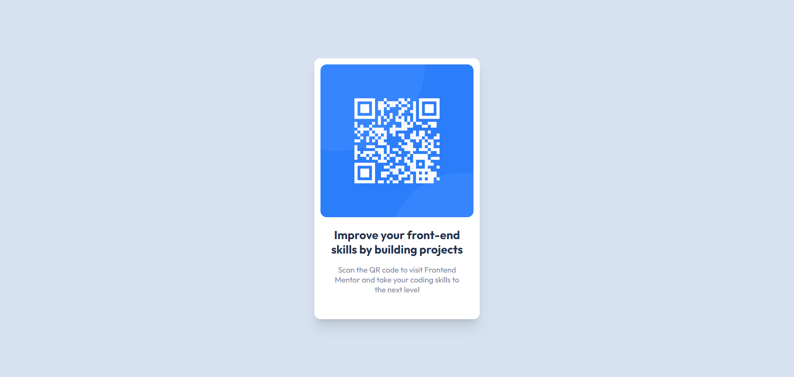

# Frontend Mentor - QR code component solution

This is a solution to the [QR code component challenge on Frontend Mentor](https://www.frontendmentor.io/challenges/qr-code-component-iux_sIO_H). Frontend Mentor challenges help you improve your coding skills by building realistic projects. 

## Table of contents

- [Screenshot](#screenshot)
- [Links](#links)
- [Built with](#built-with)
- [Author](#author)

### Screenshot

### Links

- Solution URL: [Github](https://github.com/script-doodle/qr-code-component)
- Live Site URL: [Netlify](https://qr-code-component-200125j.netlify.app/)

### Built with

- Semantic HTML5 markup
- CSS custom properties
- Flexbox
- CSS Grid
- Mobile-first workflow

## Author

- Twitter - [@script_doodle](https://www.twitter.com/script_doole)
- Github - [@script-doodle](https://github.com/script-doodle/)
- Frontend Mentor - [@boredmahin](https://www.frontendmentor.io/profile/boredmahin)
